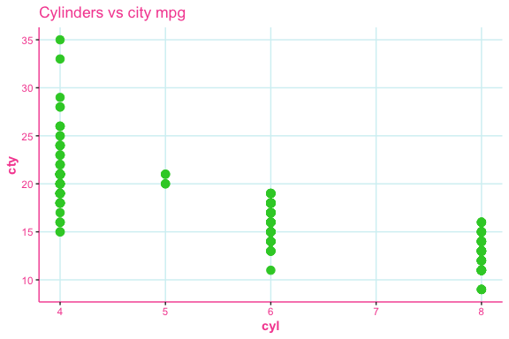
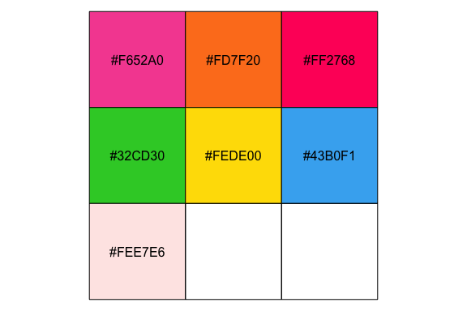
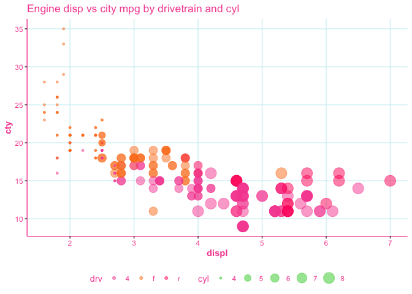
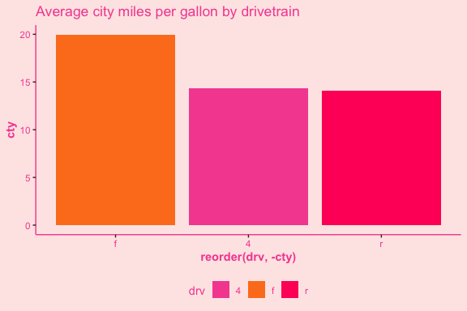
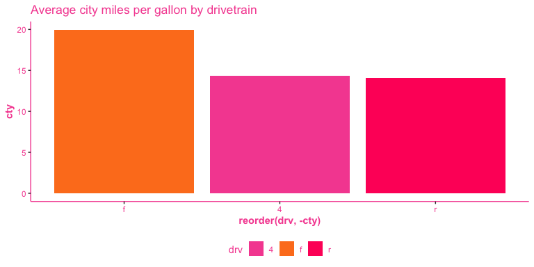
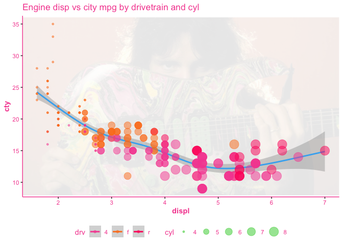

# ggshredR

Colour palettes and plotting themes for `ggplot2` that resembles 80s
guitar. Incredible example below of Racer X


## Installation

You can install `ggshredR` from GitHub by running the following:

``` r
devtools::install_github("hendersontrent/ggshredR")
```

## Theme shredR

The theme works by adding the function call to the end of your `ggplot2`
code:

``` r
library(ggplot2)
library(ggshredR)

ggplot(mpg, aes(x = cyl, y = cty)) +
  geom_point(size = 3) +
  labs(title = "Cylinders vs city mpg") +
  theme_shredR(grids = TRUE)
```

<!-- -->

The colour palette built into the package is presented below:

``` r
library(scales)

scales::show_col(ggshredR:::shredR_palette)
```

<!-- -->

## This palette can be used for colouring (and filling) plots

Use `scale_colour_shredR()` to apply the theme for colour parameters.

``` r
ggplot(mpg, aes(x = displ, y = cty, colour = drv, size = cyl)) +
geom_point(alpha = 0.5) +
labs(title = "Engine disp vs city mpg by drivetrain and cyl") +
scale_colour_shredR() +
theme_shredR(grids = TRUE)
```

<!-- -->

Fitting regression models such as generalised additive models (GAM) to
charts also looks very shreddy.

``` r
library(mgcv)

ggplot(mpg, aes(x = displ, y = cty, colour = drv, size = cyl)) +
geom_smooth(aes(group = 1), formula = y ~ s(x), method = "gam", size = 1) +
geom_point(alpha = 0.5) +
labs(title = "Engine disp vs city mpg by drivetrain and cyl") +
scale_colour_shredR() +
theme_shredR(grids = TRUE)
```

<!-- -->

And `scale_fill_shredR()` to apply the theme for fill parameters.

``` r
library(dplyr)
library(magrittr)

mpg %>%
group_by(drv) %>%
summarise(cty = mean(cty)) %>%
ungroup()%>%
ggplot(aes(x = reorder(drv, -cty), y = cty, fill = drv)) +
geom_col() +
labs(title = "Average city mpg by drivetrain") +
scale_fill_shredR() +
theme_shredR()
```

<!-- -->

## You can also add a watermark of a 1980s shred lord to ensure your riffs (and plots) are tight.

This is achieved through the `make_it_shred` function. This function
lets you specify the surname of a shred guitar legend who was prominent
in the 80s.

``` r
ggplot(mpg, aes(x = displ, y = cty, colour = drv, size = cyl)) +
make_it_shred(shred_lord = "Vai") +
geom_smooth(aes(group = 1), formula = y ~ s(x), method = "gam", size = 1) +
geom_point(alpha = 0.5) +
labs(title = "Engine disp vs city mpg by drivetrain and cyl") +
scale_colour_shredR() +
theme_shredR(grids = FALSE)
```

<!-- -->
